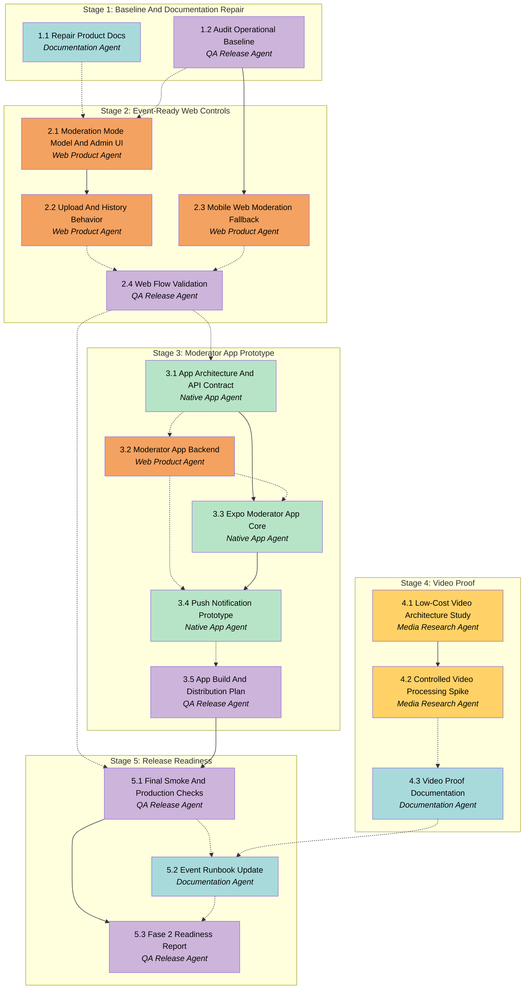

# APM Plan

## Workers

| Worker | Domain | Description |
| --- | --- | --- |
| Documentation Agent | Product Documentation | Repairs and updates product, roadmap, backlog, and operational documentation so future work is based on clean current references. |
| Web Product Agent | Next.js Product App | Implements event moderation mode, admin warnings, upload behavior, moderation web fallback, and production web changes. |
| Native App Agent | Expo Moderator App | Designs and builds the first Android/iOS moderator app prototype using Expo/React Native. |
| Media Research Agent | Video Proof | Studies and prototypes controlled video processing with low-cost infrastructure constraints. |
| QA Release Agent | Validation And Release | Validates flows, checks production readiness, updates release evidence, and prepares event fallback/readiness reports. |

## Stages

| Stage | Name | Tasks | Agents |
| --- | --- | --- | --- |
| 1 | Baseline And Documentation Repair | 2 | Documentation Agent, QA Release Agent |
| 2 | Event-Ready Web Controls | 4 | Web Product Agent, QA Release Agent |
| 3 | Moderator App Prototype | 5 | Native App Agent, Web Product Agent, QA Release Agent |
| 4 | Video Proof | 3 | Media Research Agent, Documentation Agent |
| 5 | Release Readiness | 3 | QA Release Agent, Documentation Agent |

## Dependency Graph

---

> **Notes:** The critical path for the 2026-07-11 event is Stage 1 -> Stage 2 -> Stage 5. Stage 3 should advance aggressively, but store distribution is externally constrained by missing Apple Developer and Google Play Developer accounts. Stage 4 is intentionally isolated so video exploration cannot destabilize event readiness. Web moderation remains the fallback if native app distribution is blocked.

## Stage 1: Baseline And Documentation Repair

### Task 1.1: Repair Product Docs - Documentation Agent

* **Objective:** Clean and update the project documentation so Fase 2 execution is based on accurate product context.
* **Output:** Updated `docs/PRD.md`, `docs/BACKLOG.md`, `docs/ROADMAP.md`, and any directly affected overview docs with corrupted/truncated sections repaired.
* **Validation:** Documents have no visibly truncated lines, reflect the approved Fase 2 scope from Spec, and preserve useful MVP history without claiming unimplemented features are complete.
* **Guidance:** Use Spec sections Product Direction, Guest Experience, Moderation Modes, Native Moderator App, Video Direction, and Out Of Scope as the authoritative Fase 2 source. Keep Portuguese user-facing docs natural and accented. Do not introduce billing implementation as in-scope.
* **Dependencies:** None.
1. Identify corrupted/truncated sections in current product docs.
2. Rewrite those sections to cleanly describe the current MVP and Fase 2 scope.
3. Add app moderator, moderation mode, video proof, and low-cost infrastructure decisions where appropriate.
4. Remove or clarify stale MVP-only statements that conflict with current production behavior.
5. Verify the docs are readable and internally consistent.

### Task 1.2: Audit Operational Baseline - QA Release Agent

* **Objective:** Establish a factual baseline of current production and local readiness before Fase 2 changes begin.
* **Output:** A concise baseline report in `docs/STATUS_IMPLEMENTACAO.md` or a new dated QA note under `docs/`, covering current commands, production availability, and known risks.
* **Validation:** Report includes current branch status, validated commands, production URL check, current app routes relevant to upload/moderation/screen, and any discovered blockers.
* **Guidance:** Use existing scripts and production checks without changing code. Treat untracked APM files as expected unless they interfere. Prefer concrete command output summaries over broad claims.
* **Dependencies:** None.
1. Check Git status and current package scripts.
2. Run local validation commands appropriate for a baseline check.
3. Verify production availability for public routes.
4. Inspect current upload, moderation, screen, and admin route behavior at a high level.
5. Record findings and risks for downstream work.

## Stage 2: Event-Ready Web Controls

### Task 2.1: Moderation Mode Model And Admin UI - Web Product Agent

* **Objective:** Add event-level configuration for com/sem moderacao and expose it clearly in the admin event settings.
* **Output:** Schema/model changes, admin settings UI, and server-side settings handling for event moderation mode.
* **Validation:** Admin can configure an event as com moderacao or sem moderacao; sem moderacao displays a strong warning that photos appear directly on the screen; lint, typecheck, and build pass.
* **Guidance:** Follow Spec Moderation Modes. Start with event-level mode only. Use existing admin event settings patterns. Preserve existing events by defaulting to current com moderacao behavior.
* **Dependencies:** **Task 1.1 by Documentation Agent**, **Task 1.2 by QA Release Agent**.
1. Add a durable event-level moderation mode field or equivalent schema representation.
2. Create and validate any required migration and generated Prisma updates.
3. Add admin settings controls with clear labels and warning copy.
4. Ensure existing events remain com moderacao by default.
5. Validate local build and types.

### Task 2.2: Upload And History Behavior - Web Product Agent

* **Objective:** Apply moderation mode to guest uploads and improve guest media selection behavior.
* **Output:** Upload API behavior creates pending photos in com moderacao and auto-approved photos in sem moderacao, with appropriate history/audit handling and a safer client selection flow for the 15-item batch limit.
* **Validation:** In com moderacao, uploaded photos remain pending; in sem moderacao, uploaded photos become approved and appear in the approved feed; removal/rejection after auto-approval remains possible; selecting more than 15 media items does not discard the guest's valid existing selection and shows a clear limit message; lint, typecheck, and build pass.
* **Guidance:** Follow Spec Moderation Modes and Guest Experience. If recording automatic moderation decision requires schema or enum changes, keep the model explicit and migration-safe. Do not weaken existing event status validation. Treat the 15-item selection rule as a guest UX protection that should apply to photos now and remain compatible with future video support.
* **Dependencies:** Task 2.1 by Web Product Agent.
1. Update upload creation logic to branch on event moderation mode.
2. Record enough state/history to explain auto-approved photos later.
3. Ensure screen approved-photo APIs include auto-approved photos naturally.
4. Verify moderation actions can still reject/remove an auto-approved photo.
5. Update client-side media selection so selecting more than 15 items is blocked or warned without clearing already selected valid items.
6. Add focused tests or smoke coverage where the project structure supports it.

### Task 2.3: Mobile Web Moderation Fallback - Web Product Agent

* **Objective:** Improve the existing web moderation page as the reliable fallback for event operation.
* **Output:** Updated moderation UI optimized for phone use, with clearer pending counts, larger actions, safer review flow, and no regression to approve/reject/bulk actions.
* **Validation:** Moderation is usable at mobile widths without horizontal overflow; individual and bulk approve/reject actions remain available; new-photo refresh behavior still works; lint, typecheck, and build pass.
* **Guidance:** Follow Spec Moderator Web Fallback. Preserve existing token/cookie access model. Keep web fallback independent of native app success.
* **Dependencies:** Task 1.2 by QA Release Agent.
1. Review current /moderate/[token] layout at common mobile widths.
2. Improve touch targets, spacing, photo preview hierarchy, and action placement.
3. Keep destructive actions visually distinct and hard to trigger accidentally.
4. Verify pending/approved/rejected tabs and bulk actions still work.
5. Run local validation and note any manual browser checks.

### Task 2.4: Web Flow Validation - QA Release Agent

* **Objective:** Validate event-ready web changes before app work depends on them.
* **Output:** Validation evidence covering com moderacao, sem moderacao, upload selection limit UX, moderation web fallback, and screen updates.
* **Validation:** Report shows pass/fail upload -> moderation/screen behavior in both modes, confirms selecting more than 15 media items does not force the guest to restart a valid selection, includes mobile moderation sanity check, and covers production deploy readiness.
* **Guidance:** This task validates Stage 2 deliverables and should summarize exact commands and route checks. If production deploy occurs, record deployment result and URL check.
* **Dependencies:** **Task 2.2 by Web Product Agent**, **Task 2.3 by Web Product Agent**.
1. Run lint, typecheck, and build after Stage 2 changes.
2. Validate com moderacao upload behavior.
3. Validate sem moderacao upload behavior.
4. Validate upload selection behavior when more than 15 items are selected.
5. Validate moderation web fallback at mobile dimensions.
6. Record findings and remaining risks.

## Stage 3: Moderator App Prototype

### Task 3.1: App Architecture And API Contract - Native App Agent

* **Objective:** Define the native moderator app architecture and backend API contract before implementation.
* **Output:** Technical design document for Expo app structure, login by e-mail invitation, session/device registration, moderation endpoints, and push behavior.
* **Validation:** Document covers data flow, screens, API contract, device registration, notification grouping, distribution constraints, and free/low-cost infrastructure assumptions.
* **Guidance:** Follow Spec Native Moderator App and Infrastructure And Cost Constraints. Treat App Store/Google Play publication as desirable but externally constrained. Keep guest app out of scope.
* **Dependencies:** **Task 2.4 by QA Release Agent**.
1. Review current moderation token and invite implementation.
2. Define app login/access flow based on e-mail invitation.
3. Define app API endpoints and response shapes.
4. Define device token registration and notification grouping behavior.
5. Document distribution assumptions and open external account needs.

### Task 3.2: Moderator App Backend - Web Product Agent

* **Objective:** Provide backend support needed by the moderator app prototype.
* **Output:** API routes or server actions for moderator invitation validation, app session/device registration, pending-photo retrieval, approve/reject operations, and push dispatch hooks if feasible.
* **Validation:** Backend endpoints are authenticated/scoped to the invited moderator/event, do not expose other events, support pending-photo retrieval and moderation actions, and pass lint/typecheck/build.
* **Guidance:** Follow Spec Native Moderator App. Do not break existing web moderator token flow. Prefer reusing existing moderation access and decision-recording logic where possible.
* **Dependencies:** **Task 3.1 by Native App Agent**.
1. Implement app-safe moderator access/session handling.
2. Add event-scoped pending photo endpoint for the app.
3. Add app moderation action endpoint reusing existing status/history rules.
4. Add device registration storage or a minimal prototype-compatible equivalent.
5. Add push dispatch integration points without requiring paid infrastructure.

### Task 3.3: Expo Moderator App Core - Native App Agent

* **Objective:** Build the first Expo/React Native moderator app prototype for event-scoped moderation.
* **Output:** Expo app scaffold and screens for invite login/access, pending photo list, photo detail, approve/reject actions, and basic session persistence.
* **Validation:** App can run locally in Expo, authenticate against the backend prototype path, display pending photos, and submit approve/reject actions in a test environment.
* **Guidance:** Follow Spec Native Moderator App. Keep UI focused on fast moderation. Guest upload is out of scope. Use TypeScript where practical and avoid adding paid services.
* **Dependencies:** Task 3.1 by Native App Agent, **Task 3.2 by Web Product Agent**.
1. Create the Expo app workspace in an agreed location in the repository.
2. Implement configuration for backend base URL.
3. Implement invitation/login flow.
4. Implement pending list and photo detail UI.
5. Implement approve/reject actions and session persistence.

### Task 3.4: Push Notification Prototype - Native App Agent

* **Objective:** Prototype push notification registration and grouped new-photo alerts for moderator devices.
* **Output:** App-side push registration plus backend-compatible integration documentation or implementation for notifying moderators of new pending photos.
* **Validation:** A test device or simulator path can register for notifications where supported; grouping/throttling behavior is documented or implemented; failure modes do not block web upload/moderation.
* **Guidance:** Follow Spec Native Moderator App and Infrastructure And Cost Constraints. Expo notifications are acceptable. Avoid one notification per photo during bursts.
* **Dependencies:** **Task 3.2 by Web Product Agent**, Task 3.3 by Native App Agent.
1. Configure app notification permissions and token registration.
2. Connect registered token to moderator/event backend representation.
3. Implement or document grouped pending-photo notification dispatch.
4. Validate behavior in the most available development environment.
5. Document limitations for iOS/Android store or account requirements.

### Task 3.5: App Build And Distribution Plan - QA Release Agent

* **Objective:** Prepare the app prototype for realistic testing and document store/account blockers.
* **Output:** Build/distribution checklist, test-build instructions, and account-readiness notes for Apple Developer and Google Play Developer.
* **Validation:** Report identifies what can be tested before store accounts exist, what requires Apple/Google accounts, and the safest plan for the 2026-07-11 event.
* **Guidance:** Do not promise store publication. Treat testable build as acceptable near-term outcome if accounts or reviews block distribution.
* **Dependencies:** **Task 3.4 by Native App Agent**.
1. Review Expo/EAS build requirements used by the prototype.
2. Document iOS and Android distribution options with account prerequisites.
3. Identify fastest safe path for moderator testing.
4. Record store submission blockers and user actions needed.
5. Provide fallback recommendation if app distribution is not ready.

## Stage 4: Video Proof

### Task 4.1: Low-Cost Video Architecture Study - Media Research Agent

* **Objective:** Study feasible low-cost/free-tier approaches for short video clip processing.
* **Output:** Technical note comparing processing approaches, storage implications, original-retention options, and cost risks.
* **Validation:** Note covers 5-10 second clip target, original retention/discard options, R2/storage implications, processing location options, and explicit cost concerns.
* **Guidance:** Follow Spec Video Direction and Infrastructure And Cost Constraints. This is not a production video feature.
* **Dependencies:** None.
1. Review current storage adapter and media model.
2. Identify feasible video processing approaches compatible with the stack.
3. Estimate storage and bandwidth impact qualitatively.
4. Compare original retention options.
5. Recommend a low-risk proof path.

### Task 4.2: Controlled Video Processing Spike - Media Research Agent

* **Objective:** Build or outline a minimal controlled proof that can transform a sample video into a 5-10 second clip.
* **Output:** Prototype script, sandboxed experiment, or documented reproducible proof that demonstrates video clipping feasibility without touching production event flow.
* **Validation:** Proof either produces a short clip from a sample input or clearly documents the blocker; it does not modify production upload behavior; cost/security implications are noted.
* **Guidance:** Keep this isolated from the guest upload flow. Avoid paid infrastructure. Prefer a local or development-only proof if production-safe video processing is not ready.
* **Dependencies:** Task 4.1 by Media Research Agent.
1. Select the safest proof mechanism from the study.
2. Run or document the video clipping proof with sample input.
3. Capture output format, processing time, and constraints.
4. Avoid changes that affect production photo uploads.
5. Record findings for documentation.

### Task 4.3: Video Proof Documentation - Documentation Agent

* **Objective:** Convert the video study and spike into product-facing technical documentation.
* **Output:** Updated or new documentation describing video feasibility, recommended future architecture, and non-goals for the 2026-07-11 event.
* **Validation:** Documentation states video is not in the live event flow, explains 5-10 second clip direction, covers original retention choices, and flags cost risks.
* **Guidance:** Follow Spec Video Direction. Keep recommendations practical and cost-aware.
* **Dependencies:** **Task 4.2 by Media Research Agent**.
1. Read the video study and spike findings.
2. Write the recommended future video direction.
3. Document options for originals: discard, temporary retention, or paid-plan retention.
4. Add risks and validation needs for future implementation.
5. Link the video proof to Fase 2 status docs.

## Stage 5: Release Readiness

### Task 5.1: Final Smoke And Production Checks - QA Release Agent

* **Objective:** Validate the production-ready subset of Fase 2 before the 2026-07-11 event.
* **Output:** Final smoke check report covering web guest upload, moderation modes, moderation web fallback, screen behavior, and app prototype status.
* **Validation:** Report includes exact commands/checks, pass/fail results, production URL status, and explicit risks remaining for the event.
* **Guidance:** Focus on event readiness, not perfect completion of every strategic item. Include app fallback status honestly.
* **Dependencies:** **Task 2.4 by QA Release Agent**, Task 3.5 by QA Release Agent.
1. Run project validation commands.
2. Check production public pages and relevant protected-route behavior where possible.
3. Verify com/sem moderacao behavior is ready or document blocker.
4. Verify moderation web fallback remains usable.
5. Summarize app prototype and video proof status.

### Task 5.2: Event Runbook Update - Documentation Agent

* **Objective:** Update the operational runbook for the 2026-07-11 event.
* **Output:** Updated `docs/OPERACAO_EVENTO.md` and related docs with setup, moderation mode choice, app/web fallback, and incident actions.
* **Validation:** Runbook includes before-event setup, during-event actions, sem moderacao warning, app fallback, web moderation fallback, QR/screen checks, and after-event export steps.
* **Guidance:** Use final QA findings and Spec decisions. Keep instructions suitable for a non-technical operator.
* **Dependencies:** **Task 5.1 by QA Release Agent**, **Task 4.3 by Documentation Agent**.
1. Update before-event checklist.
2. Add moderation mode decision instructions.
3. Add app moderator setup if available and web fallback otherwise.
4. Update problem/common incident guidance.
5. Add final event-day readiness checklist.

### Task 5.3: Fase 2 Readiness Report - QA Release Agent

* **Objective:** Produce a final concise readiness report for the user before the event.
* **Output:** Fase 2 readiness report summarizing shipped items, pending risks, deployment status, app status, video proof status, and event-day recommendations.
* **Validation:** Report separates complete, partially complete, blocked, and deferred work; it names any user actions required for stores/accounts; it includes final production URL check.
* **Guidance:** Be explicit about store limitations and app fallback. Do not hide risks behind optimistic language.
* **Dependencies:** Task 5.1 by QA Release Agent, **Task 5.2 by Documentation Agent**.
1. Gather Stage 2, Stage 3, Stage 4, and runbook outcomes.
2. Classify each deliverable by status.
3. Identify remaining risks for the 2026-07-11 event.
4. List any required user actions.
5. Produce final readiness summary.
